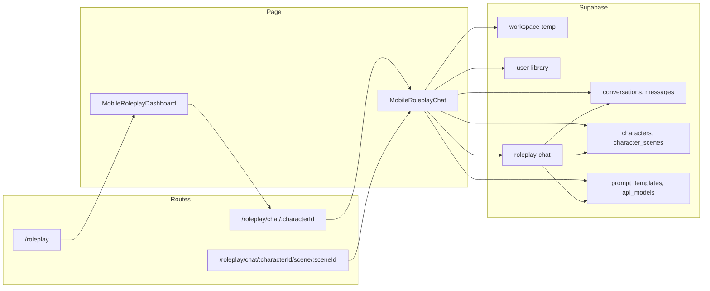

# Roleplay Two-Way Chat Page – File, Table, Storage & Edge Function Audit

## Page and routes

The roleplay chat (two-way conversation) is implemented as a single page component used for two routes:

- `**/roleplay/chat/:characterId**` – Chat with a character (optional scene from URL or auto-selected)
- `**/roleplay/chat/:characterId/scene/:sceneId**` – Chat with a specific scene pre-selected

**Entry flow:** User lands on `**/roleplay**` ([MobileRoleplayDashboard](src/pages/MobileRoleplayDashboard.tsx)), then taps a character card to navigate to the chat routes above. Dashboard is the main entry; chat is the “two-way chat” page.

**Docs:** [docs/01-PAGES/07-ROLEPLAY/](docs/01-PAGES/07-ROLEPLAY/) — UX_CHAT.md describes the chat page; PURPOSE.md and DEVELOPMENT_STATUS.md describe scope and status.

---

## 1. Files related to the roleplay chat page

### Page (entry point)

| File                                                                           | Role                                                                                                     |
| ------------------------------------------------------------------------------ | -------------------------------------------------------------------------------------------------------- |
| [src/App.tsx](src/App.tsx)                                                     | Defines routes: `/roleplay`, `/roleplay/chat/:characterId`, `/roleplay/chat/:characterId/scene/:sceneId` |
| [src/pages/MobileRoleplayChat.tsx](src/pages/MobileRoleplayChat.tsx)           | Chat page component (two-way chat UI, messages, scene generation, persistence)                           |
| [src/pages/MobileRoleplayDashboard.tsx](src/pages/MobileRoleplayDashboard.tsx) | Roleplay entry; navigates to chat when user selects a character                                          |

### Roleplay components (used by chat or dashboard that leads to chat)

| File                                                                                                     | Used by                                             |
| -------------------------------------------------------------------------------------------------------- | --------------------------------------------------- |
| [src/components/roleplay/MobileChatHeader.tsx](src/components/roleplay/MobileChatHeader.tsx)             | Chat – back, avatar, name, menu                     |
| [src/components/roleplay/MobileChatInput.tsx](src/components/roleplay/MobileChatInput.tsx)               | Chat – text input and send                          |
| [src/components/roleplay/ChatMessage.tsx](src/components/roleplay/ChatMessage.tsx)                       | Chat – message bubbles and inline scene images      |
| [src/components/roleplay/ChatBottomNav.tsx](src/components/roleplay/ChatBottomNav.tsx)                   | Chat – bottom nav (Home, Settings, Info, More)      |
| [src/components/roleplay/CharacterInfoDrawer.tsx](src/components/roleplay/CharacterInfoDrawer.tsx)       | Chat – character details and scenes                 |
| [src/components/roleplay/QuickSettingsDrawer.tsx](src/components/roleplay/QuickSettingsDrawer.tsx)       | Chat – model/style settings                         |
| [src/components/roleplay/RoleplaySettingsModal.tsx](src/components/roleplay/RoleplaySettingsModal.tsx)   | Chat – full settings (e.g. desktop)                 |
| [src/components/roleplay/RoleplayHeader.tsx](src/components/roleplay/RoleplayHeader.tsx)                 | Chat – header variant                               |
| [src/components/roleplay/MobileCharacterSheet.tsx](src/components/roleplay/MobileCharacterSheet.tsx)     | Chat – character sheet                              |
| [src/components/roleplay/ModelSelector.tsx](src/components/roleplay/ModelSelector.tsx)                   | Chat – model selection                              |
| [src/components/roleplay/ScenarioSetupWizard.tsx](src/components/roleplay/ScenarioSetupWizard.tsx)       | Chat – scenario setup                               |
| [src/components/roleplay/SceneGenerationModal.tsx](src/components/roleplay/SceneGenerationModal.tsx)     | Chat – scene generation modal                       |
| [src/components/roleplay/ContextMenu.tsx](src/components/roleplay/ContextMenu.tsx)                       | Chat – context menu                                 |
| [src/components/roleplay/MobileCharacterCard.tsx](src/components/roleplay/MobileCharacterCard.tsx)       | Dashboard → navigates to chat                       |
| [src/components/roleplay/QuickModificationSheet.tsx](src/components/roleplay/QuickModificationSheet.tsx) | Scene modification from chat (e.g. tap scene image) |
| [src/components/OurVidzDashboardLayout.tsx](src/components/OurVidzDashboardLayout.tsx)                   | Layout wrapper for chat (and dashboard)             |

### Hooks (chat page and its dependencies)

| File                                                                   | Purpose                                                                                                      |
| ---------------------------------------------------------------------- | ------------------------------------------------------------------------------------------------------------ |
| [src/hooks/useRoleplayModels.ts](src/hooks/useRoleplayModels.ts)       | Chat/image model options from DB; used for model selector                                                    |
| [src/hooks/useImageModels.ts](src/hooks/useImageModels.ts)             | Image model options for scene generation                                                                     |
| [src/hooks/useUserCharacters.ts](src/hooks/useUserCharacters.ts)       | User’s characters (personas) and default; used for identity in chat                                          |
| [src/hooks/useSceneContinuity.ts](src/hooks/useSceneContinuity.ts)     | I2I scene continuity and reference resolution                                                                |
| [src/hooks/useUserConversations.ts](src/hooks/useUserConversations.ts) | Conversations list (dashboard “Continue”); scene thumbnails; used when loading/creating conversation in chat |
| [src/hooks/useMobileDetection.ts](src/hooks/useMobileDetection.ts)     | Mobile/tablet/desktop detection                                                                              |
| [src/hooks/useKeyboardVisible.ts](src/hooks/useKeyboardVisible.ts)     | Keyboard visibility (mobile)                                                                                 |
| [src/hooks/use-toast.ts](src/hooks/use-toast.ts)                       | Toasts                                                                                                       |
| [src/hooks/useSignedImageUrls.ts](src/hooks/useSignedImageUrls.ts)     | Signed URLs for character/user images (e.g. user-library)                                                    |

### Services and types

| File                                                                                   | Purpose                                                                                     |
| -------------------------------------------------------------------------------------- | ------------------------------------------------------------------------------------------- |
| [src/services/ImageConsistencyService.ts](src/services/ImageConsistencyService.ts)     | Consistency settings and scene reference handling                                           |
| [src/lib/services/WorkspaceAssetService.ts](src/lib/services/WorkspaceAssetService.ts) | Workspace assets (e.g. scene images) create/update                                          |
| [src/types/roleplay.ts](src/types/roleplay.ts)                                         | Character, Message, CharacterScene, SceneStyle, ScenarioSessionPayload, ImageGenerationMode |
| [src/integrations/supabase/client.ts](src/integrations/supabase/client.ts)             | Supabase client used by chat page                                                           |

### Context and UI primitives

| File                                                                                                                                                                         | Purpose                          |
| ---------------------------------------------------------------------------------------------------------------------------------------------------------------------------- | -------------------------------- |
| [src/contexts/AuthContext.tsx](src/contexts/AuthContext.tsx)                                                                                                                 | user, profile; required for chat |
| [src/components/ui/button.tsx](src/components/ui/button.tsx), [input](src/components/ui/input.tsx), [card](src/components/ui/card.tsx), [badge](src/components/ui/badge.tsx) | UI used in chat                  |

**Note:** [src/components/roleplay/RoleplayPromptInput.tsx](src/components/roleplay/RoleplayPromptInput.tsx) is not imported by MobileRoleplayChat; the chat page uses MobileChatInput. RoleplayPromptInput appears in archived RoleplayChat.

---

## 2. Supabase tables used by the roleplay chat flow

Tables are used either in [MobileRoleplayChat.tsx](src/pages/MobileRoleplayChat.tsx) or in hooks/services the chat page uses, or in the [roleplay-chat](supabase/functions/roleplay-chat/index.ts) edge function.

### Core chat and identity

| Table             | Where used                                                                                                          | Purpose                                                                           |
| ----------------- | ------------------------------------------------------------------------------------------------------------------- | --------------------------------------------------------------------------------- |
| **conversations** | MobileRoleplayChat, useUserConversations, roleplay-chat                                                             | Conversation rows; `last_scene_image`, `user_character_id`; create/update by chat |
| **messages**      | MobileRoleplayChat, useUserConversations, roleplay-chat                                                             | Chat messages; insert/select for current thread                                   |
| **characters**    | MobileRoleplayChat, roleplay-chat, useUserCharacters, ImageConsistencyService                                       | AI character metadata, image_url, prompts                                         |
| **user_roles**    | useUserCharacters, MobileCharacterCard, CharacterInfoDrawer, CharacterEditModal, CharacterPreviewModal, AuthContext | User roles (e.g. admin); character ownership                                      |
| **profiles**      | useUserCharacters, AuthContext, AgeVerificationModal                                                                | User profile                                                                      |

### Scenes and templates

| Table                | Where used                                                                                                                   | Purpose                                                              |
| -------------------- | ---------------------------------------------------------------------------------------------------------------------------- | -------------------------------------------------------------------- |
| **character_scenes** | MobileRoleplayChat, roleplay-chat, useUserConversations, useSceneContinuity, CharacterInfoDrawer, ScenePromptEditModal, etc. | Scene templates per character; scene prompts and refs for generation |
| **scenes**           | MobileRoleplayChat, useSceneGallery, useSceneCreation                                                                        | Scene templates (e.g. gallery); used in chat for template list       |
| **prompt_templates** | MobileRoleplayChat, roleplay-chat                                                                                            | System/content prompts for chat and scene generation                 |

### Models and config

| Table             | Where used                                                                                   | Purpose                               |
| ----------------- | -------------------------------------------------------------------------------------------- | ------------------------------------- |
| **api_models**    | roleplay-chat, useRoleplayModels, useImageModels, ModelSelectionModal, CharacterImageService | Chat and image model config           |
| **api_providers** | roleplay-chat, useApiProviders                                                               | Provider config for API models        |
| **system_config** | roleplay-chat, useLocalModelHealth, SystemConfigTab                                          | Worker URLs, health cache, app config |

### Memory (referenced in roleplay-chat)

| Table                | Where used    | Purpose                          |
| -------------------- | ------------- | -------------------------------- |
| **character_memory** | roleplay-chat | Character-level memory (if used) |
| **profile_memory**   | roleplay-chat | Profile-level memory (if used)   |

### Assets and library

| Table                | Where used                                                                           | Purpose                                                                            |
| -------------------- | ------------------------------------------------------------------------------------ | ---------------------------------------------------------------------------------- |
| **workspace_assets** | MobileRoleplayChat, WorkspaceAssetService, useUserConversations, useGeneration, etc. | Temporary scene images; job results; realtime updates                              |
| **user_library**     | MobileRoleplayChat, useUserConversations, LibraryAssetService, AssetService, etc.    | Persisted assets (e.g. scene thumbnails); path in `conversations.last_scene_image` |

### Usage and jobs

| Table              | Where used                                                | Purpose                                     |
| ------------------ | --------------------------------------------------------- | ------------------------------------------- |
| **api_usage_logs** | roleplay-chat                                             | Log chat/image usage                        |
| **jobs**           | useUserCharacters, useGeneration, useClipGeneration, etc. | Generation jobs (scene gen can create jobs) |

### RPC (used by roleplay-chat)

| RPC                        | Purpose       |
| -------------------------- | ------------- |
| **upsert_usage_aggregate** | roleplay-chat |

---

## 3. Storage buckets used by the roleplay chat flow

Buckets are referenced in [MobileRoleplayChat.tsx](src/pages/MobileRoleplayChat.tsx), [useUserConversations.ts](src/hooks/useUserConversations.ts), and related signing/upload helpers.

| Bucket               | Purpose in roleplay chat                                                                                                                       |
| -------------------- | ---------------------------------------------------------------------------------------------------------------------------------------------- |
| **workspace-temp**   | Temporary scene images during generation; download for persistence; signed URLs for inline scene images before they are copied to user-library |
| **user-library**     | Persistent scene thumbnails (copy from workspace-temp); character/persona avatars; signed URLs for character and user persona images in chat   |
| **reference_images** | Not used directly in MobileRoleplayChat; used by character studio / reference flows that can affect character refs used in scene generation    |

**Note:** DB table for library assets is `user_library` (underscore); storage bucket name is `user-library` (hyphen). Chat and hooks use the bucket name `'user-library'` for storage API calls.

---

## 4. Edge functions used by the roleplay chat page

| Edge function            | Where invoked                                                                                                                                                                                                                                           | Purpose                                                                                                                              |
| ------------------------ | ------------------------------------------------------------------------------------------------------------------------------------------------------------------------------------------------------------------------------------------------------- | ------------------------------------------------------------------------------------------------------------------------------------ |
| **roleplay-chat**        | [MobileRoleplayChat.tsx](src/pages/MobileRoleplayChat.tsx) (multiple call sites for send message, scenario, etc.), [ScenePromptEditModal.tsx](src/components/roleplay/ScenePromptEditModal.tsx), [useSceneNarrative.ts](src/hooks/useSceneNarrative.ts) | Streaming chat with character; prompt templates; optional scene narrative / prompt enhancement                                       |
| **fal-image**            | [MobileRoleplayChat.tsx](src/pages/MobileRoleplayChat.tsx) (via scene generation flow), [useSceneCreation.ts](src/hooks/useSceneCreation.ts), [AddCharacterModal.tsx](src/components/roleplay/AddCharacterModal.tsx)                                    | Scene image generation (Seedream, I2I, etc.); character portrait generation                                                          |
| **enhance-prompt**       | [useSceneCreation.ts](src/hooks/useSceneCreation.ts), [useScenePromptEnhancement.ts](src/hooks/useScenePromptEnhancement.ts), [PromptEnhancementModal.tsx](src/components/PromptEnhancementModal.tsx)                                                   | Prompt enhancement for scene creation (used when creating/editing scenes from dashboard or scene flows that can be opened from chat) |
| **health-check-workers** | [useLocalModelHealth.ts](src/hooks/useLocalModelHealth.ts), [useWorkerStatus.ts](src/hooks/useWorkerStatus.ts)                                                                                                                                          | Local worker health; affects model availability in chat (e.g. useRoleplayModels)                                                     |

**Optional / indirect:** queue-job, replicate-image, get-active-worker-url, refresh-prompt-cache, character-suggestions, character-portrait are used by character creation, scene creation, or admin; they support the ecosystem but are not required for the core two-way chat send/receive path.

---

## 5. Flow summary

---

## 6. Documentation references

- [docs/01-PAGES/07-ROLEPLAY/UX_CHAT.md](docs/01-PAGES/07-ROLEPLAY/UX_CHAT.md) – Chat layout, components, interactions
- [docs/01-PAGES/07-ROLEPLAY/UX_DASHBOARD.md](docs/01-PAGES/07-ROLEPLAY/UX_DASHBOARD.md) – Dashboard and entry to chat
- [docs/01-PAGES/07-ROLEPLAY/PURPOSE.md](docs/01-PAGES/07-ROLEPLAY/PURPOSE.md) – Product goals and features
- [docs/01-PAGES/07-ROLEPLAY/DEVELOPMENT_STATUS.md](docs/01-PAGES/07-ROLEPLAY/DEVELOPMENT_STATUS.md) – Implementation status and model routing

