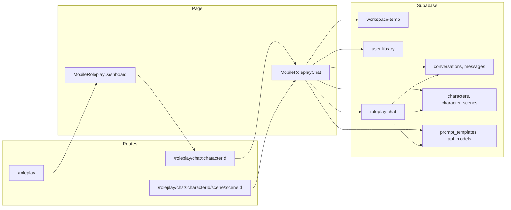

# Roleplay Two-Way Chat Page – File, Table, Storage & Edge Function Audit

## Page and routes

The roleplay chat (two-way conversation) is implemented as a single page component used for two routes:

- `**/roleplay/chat/:characterId**` – Chat with a character (optional scene from URL or auto-selected)
- `**/roleplay/chat/:characterId/scene/:sceneId**` – Chat with a specific scene pre-selected

**Entry flow:** User lands on `**/roleplay**` ([MobileRoleplayDashboard](src/pages/MobileRoleplayDashboard.tsx)), then taps a character card to navigate to the chat routes above. Dashboard is the main entry; chat is the “two-way chat” page.

**Docs:** [docs/01-PAGES/07-ROLEPLAY/](docs/01-PAGES/07-ROLEPLAY/) — UX_CHAT.md describes the chat page; PURPOSE.md and DEVELOPMENT_STATUS.md describe scope and status.

---

## 1. Files related to the roleplay chat page

### Page (entry point)

| File                                                                           | Role                                                                                                     |
| ------------------------------------------------------------------------------ | -------------------------------------------------------------------------------------------------------- |
| [src/App.tsx](src/App.tsx)                                                     | Defines routes: `/roleplay`, `/roleplay/chat/:characterId`, `/roleplay/chat/:characterId/scene/:sceneId` |
| [src/pages/MobileRoleplayChat.tsx](src/pages/MobileRoleplayChat.tsx)           | Chat page component (two-way chat UI, messages, scene generation, persistence)                           |
| [src/pages/MobileRoleplayDashboard.tsx](src/pages/MobileRoleplayDashboard.tsx) | Roleplay entry; navigates to chat when user selects a character                                          |

### Roleplay components (used by chat or dashboard that leads to chat)

| File                                                                                                     | Used by                                             |
| -------------------------------------------------------------------------------------------------------- | --------------------------------------------------- |
| [src/components/roleplay/MobileChatHeader.tsx](src/components/roleplay/MobileChatHeader.tsx)             | Chat – back, avatar, name, menu                     |
| [src/components/roleplay/MobileChatInput.tsx](src/components/roleplay/MobileChatInput.tsx)               | Chat – text input and send                          |
| [src/components/roleplay/ChatMessage.tsx](src/components/roleplay/ChatMessage.tsx)                       | Chat – message bubbles and inline scene images      |
| [src/components/roleplay/ChatBottomNav.tsx](src/components/roleplay/ChatBottomNav.tsx)                   | Chat – bottom nav (Home, Settings, Info, More)      |
| [src/components/roleplay/CharacterInfoDrawer.tsx](src/components/roleplay/CharacterInfoDrawer.tsx)       | Chat – character details and scenes                 |
| [src/components/roleplay/QuickSettingsDrawer.tsx](src/components/roleplay/QuickSettingsDrawer.tsx)       | Chat – model/style settings                         |
| [src/components/roleplay/RoleplaySettingsModal.tsx](src/components/roleplay/RoleplaySettingsModal.tsx)   | Chat – full settings (e.g. desktop)                 |
| [src/components/roleplay/RoleplayHeader.tsx](src/components/roleplay/RoleplayHeader.tsx)                 | Chat – header variant                               |
| [src/components/roleplay/MobileCharacterSheet.tsx](src/components/roleplay/MobileCharacterSheet.tsx)     | Chat – character sheet                              |
| [src/components/roleplay/ModelSelector.tsx](src/components/roleplay/ModelSelector.tsx)                   | Chat – model selection                              |
| [src/components/roleplay/ScenarioSetupWizard.tsx](src/components/roleplay/ScenarioSetupWizard.tsx)       | Chat – scenario setup                               |
| [src/components/roleplay/SceneGenerationModal.tsx](src/components/roleplay/SceneGenerationModal.tsx)     | Chat – scene generation modal                       |
| [src/components/roleplay/ContextMenu.tsx](src/components/roleplay/ContextMenu.tsx)                       | Chat – context menu                                 |
| [src/components/roleplay/MobileCharacterCard.tsx](src/components/roleplay/MobileCharacterCard.tsx)       | Dashboard → navigates to chat                       |
| [src/components/roleplay/QuickModificationSheet.tsx](src/components/roleplay/QuickModificationSheet.tsx) | Scene modification from chat (e.g. tap scene image) |
| [src/components/OurVidzDashboardLayout.tsx](src/components/OurVidzDashboardLayout.tsx)                   | Layout wrapper for chat (and dashboard)             |

### Hooks (chat page and its dependencies)

| File                                                                   | Purpose                                                                                                      |
| ---------------------------------------------------------------------- | ------------------------------------------------------------------------------------------------------------ |
| [src/hooks/useRoleplayModels.ts](src/hooks/useRoleplayModels.ts)       | Chat/image model options from DB; used for model selector                                                    |
| [src/hooks/useImageModels.ts](src/hooks/useImageModels.ts)             | Image model options for scene generation                                                                     |
| [src/hooks/useUserCharacters.ts](src/hooks/useUserCharacters.ts)       | User’s characters (personas) and default; used for identity in chat                                          |
| [src/hooks/useSceneContinuity.ts](src/hooks/useSceneContinuity.ts)     | I2I scene continuity and reference resolution                                                                |
| [src/hooks/useUserConversations.ts](src/hooks/useUserConversations.ts) | Conversations list (dashboard “Continue”); scene thumbnails; used when loading/creating conversation in chat |
| [src/hooks/useMobileDetection.ts](src/hooks/useMobileDetection.ts)     | Mobile/tablet/desktop detection                                                                              |
| [src/hooks/useKeyboardVisible.ts](src/hooks/useKeyboardVisible.ts)     | Keyboard visibility (mobile)                                                                                 |
| [src/hooks/use-toast.ts](src/hooks/use-toast.ts)                       | Toasts                                                                                                       |
| [src/hooks/useSignedImageUrls.ts](src/hooks/useSignedImageUrls.ts)     | Signed URLs for character/user images (e.g. user-library)                                                    |

### Services and types

| File                                                                                   | Purpose                                                                                     |
| -------------------------------------------------------------------------------------- | ------------------------------------------------------------------------------------------- |
| [src/services/ImageConsistencyService.ts](src/services/ImageConsistencyService.ts)     | Consistency settings and scene reference handling                                           |
| [src/lib/services/WorkspaceAssetService.ts](src/lib/services/WorkspaceAssetService.ts) | Workspace assets (e.g. scene images) create/update                                          |
| [src/types/roleplay.ts](src/types/roleplay.ts)                                         | Character, Message, CharacterScene, SceneStyle, ScenarioSessionPayload, ImageGenerationMode |
| [src/integrations/supabase/client.ts](src/integrations/supabase/client.ts)             | Supabase client used by chat page                                                           |

### Context and UI primitives

| File                                                                                                                                                                         | Purpose                          |
| ---------------------------------------------------------------------------------------------------------------------------------------------------------------------------- | -------------------------------- |
| [src/contexts/AuthContext.tsx](src/contexts/AuthContext.tsx)                                                                                                                 | user, profile; required for chat |
| [src/components/ui/button.tsx](src/components/ui/button.tsx), [input](src/components/ui/input.tsx), [card](src/components/ui/card.tsx), [badge](src/components/ui/badge.tsx) | UI used in chat                  |

**Note:** [src/components/roleplay/RoleplayPromptInput.tsx](src/components/roleplay/RoleplayPromptInput.tsx) is not imported by MobileRoleplayChat; the chat page uses MobileChatInput. RoleplayPromptInput appears in archived RoleplayChat.

---

## 2. Supabase tables and schema (MCP-verified)

**Verification:** Tables and schema below were confirmed using the Supabase MCP: `list_tables` (schemas: `['public']`) and `execute_sql` for table names and RPCs. This section reflects the **current production schema** supporting the roleplay chat process flow.

Tables are used in [MobileRoleplayChat.tsx](src/pages/MobileRoleplayChat.tsx), its hooks/services, or the [roleplay-chat](supabase/functions/roleplay-chat/index.ts) edge function.

### Core chat and identity

| Table | Key columns (MCP-verified) | Purpose in chat flow |
|-------|----------------------------|----------------------|
| **conversations** | id, user_id, character_id, user_character_id, title, conversation_type, status, memory_tier, memory_data, **last_scene_image**, **current_location**, created_at, updated_at | One row per chat thread; FK to characters (AI + user persona). `last_scene_image` stores path for dashboard thumbnails; updated when a scene is persisted to user-library. |
| **messages** | id, conversation_id, sender ('user' \| 'assistant'), content, message_type, created_at | Chat messages; insert on send, select for thread. No metadata column in DB; scene image URLs live in client/workspace_assets. |
| **characters** | id, user_id, name, description, image_url, system_prompt, persona, first_message, alternate_greetings, role ('ai' \| 'user'), content_rating, consistency_method, scene_behavior_rules, ... | AI characters and user personas. roleplay-chat loads character for system prompt and greeting. |
| **user_roles** | id, user_id, role (enum: admin, moderator, premium_user, basic_user, guest) | Used for admin/ownership checks (e.g. character edit). |
| **profiles** | id (FK auth.users), username, subscription_status, token_balance, age_verified, **default_user_character_id** (FK characters) | User profile; default_user_character_id used for persona default in chat. |

### Scenes and templates

| Table | Key columns (MCP-verified) | Purpose in chat flow |
|-------|----------------------------|----------------------|
| **character_scenes** | id, character_id, conversation_id, scene_prompt, system_prompt, image_url, generation_metadata, job_id, scene_type ('preset' \| 'conversation'), **previous_scene_id**, **previous_scene_image_url**, **generation_mode** ('t2i' \| 'i2i' \| 'modification') | Per-character scene templates and conversation-generated scenes; I2I chain via previous_scene_id. Used for scene selection and generation prompts. |
| **scenes** | id, name, description, scene_prompt, image_url, creator_id, scenario_type, setting, atmosphere (jsonb), scene_focus, narrative_style, max_words, ... | Global scene templates (gallery); used for template list and scene creation flow. |
| **prompt_templates** | id, template_name, system_prompt, use_case, content_mode, enhancer_model, job_type ('video' \| 'image' \| 'chat' \| 'roleplay'), **target_model**, is_active, token_limit, metadata | System prompts for chat and generation. roleplay-chat selects by job_type='roleplay' and target_model; scene pipeline uses job_type and target_model. |

### Models and config

| Table | Key columns (MCP-verified) | Purpose in chat flow |
|-------|----------------------------|----------------------|
| **api_models** | id, provider_id, model_key, display_name, modality ('chat' \| 'image' \| ...), task ('roleplay' \| 'chat' \| ...), endpoint_path, input_defaults (jsonb), is_active, is_default, priority | Chat and image model config; roleplay-chat and frontend load models for routing and UI. |
| **api_providers** | id, name, base_url, auth_scheme, secret_name, is_active | Provider config for API calls from roleplay-chat. |
| **system_config** | id (single row), **config** (jsonb) | App config; holds worker URLs and workerHealthCache for local model availability. |

### Memory (referenced in roleplay-chat code only)

**MCP finding:** Tables **character_memory** and **profile_memory** are **not present** in the current `public` schema. The roleplay-chat edge function references them for a planned three-tier memory feature (see DEVELOPMENT_STATUS.md “Missing”). If/when added, they would back conversation/character/profile memory.

### Assets and library

| Table | Key columns (MCP-verified) | Purpose in chat flow |
|-------|----------------------------|----------------------|
| **workspace_assets** | id, user_id, asset_type ('image' \| 'video'), temp_storage_path, job_id, original_prompt, generation_settings (jsonb), expires_at | Temporary scene images; chat creates rows and uses temp_storage_path for signed URLs; scene persistence copies to user-library and updates conversations.last_scene_image. |
| **user_library** | id, user_id, asset_type, storage_path, roleplay_metadata (jsonb), ... | Persisted assets; scene thumbnails stored here; roleplay_metadata can hold conversation_id for dashboard “Continue” thumbnails. |

### Usage and jobs

| Table | Key columns (MCP-verified) | Purpose in chat flow |
|-------|----------------------------|----------------------|
| **api_usage_logs** | id, provider_id, model_id, user_id, request_type ('chat' \| 'image' \| 'video'), tokens_*, cost_*, response_status, response_time_ms | roleplay-chat logs each chat and image request. |
| **jobs** | id, user_id, job_type, status, api_model_id, destination ('library' \| 'workspace'), workspace_session_id, ... | Generation jobs; scene generation creates jobs; job_id linked to workspace_assets and character_scenes. |

### RPCs (MCP-verified)

| RPC | Schema | Purpose in chat flow |
|-----|--------|----------------------|
| **upsert_usage_aggregate** | public | roleplay-chat calls after each api_usage_logs insert to update api_usage_aggregates (by provider_id, model_id, date_bucket, hour_bucket). |
| **backfill_usage_aggregates** | public | Exists in DB; not invoked by roleplay chat flow (admin/backfill use). |

---

## 3. Storage buckets used by the roleplay chat flow

Buckets are referenced in [MobileRoleplayChat.tsx](src/pages/MobileRoleplayChat.tsx), [useUserConversations.ts](src/hooks/useUserConversations.ts), and related signing/upload helpers.

| Bucket               | Purpose in roleplay chat                                                                                                                       |
| -------------------- | ---------------------------------------------------------------------------------------------------------------------------------------------- |
| **workspace-temp**   | Temporary scene images during generation; download for persistence; signed URLs for inline scene images before they are copied to user-library |
| **user-library**     | Persistent scene thumbnails (copy from workspace-temp); character/persona avatars; signed URLs for character and user persona images in chat   |
| **reference_images** | Not used directly in MobileRoleplayChat; used by character studio / reference flows that can affect character refs used in scene generation    |

**Note:** DB table for library assets is `user_library` (underscore); storage bucket name is `user-library` (hyphen). Chat and hooks use the bucket name `'user-library'` for storage API calls.

---

## 4. Edge functions used by the roleplay chat page

| Edge function            | Where invoked                                                                                                                                                                                                                                           | Purpose                                                                                                                              |
| ------------------------ | ------------------------------------------------------------------------------------------------------------------------------------------------------------------------------------------------------------------------------------------------------- | ------------------------------------------------------------------------------------------------------------------------------------ |
| **roleplay-chat**        | [MobileRoleplayChat.tsx](src/pages/MobileRoleplayChat.tsx) (multiple call sites for send message, scenario, etc.), [ScenePromptEditModal.tsx](src/components/roleplay/ScenePromptEditModal.tsx), [useSceneNarrative.ts](src/hooks/useSceneNarrative.ts) | Streaming chat with character; prompt templates; optional scene narrative / prompt enhancement                                       |
| **fal-image**            | [MobileRoleplayChat.tsx](src/pages/MobileRoleplayChat.tsx) (via scene generation flow), [useSceneCreation.ts](src/hooks/useSceneCreation.ts), [AddCharacterModal.tsx](src/components/roleplay/AddCharacterModal.tsx)                                    | Scene image generation (Seedream, I2I, etc.); character portrait generation                                                          |
| **enhance-prompt**       | [useSceneCreation.ts](src/hooks/useSceneCreation.ts), [useScenePromptEnhancement.ts](src/hooks/useScenePromptEnhancement.ts), [PromptEnhancementModal.tsx](src/components/PromptEnhancementModal.tsx)                                                   | Prompt enhancement for scene creation (used when creating/editing scenes from dashboard or scene flows that can be opened from chat) |
| **health-check-workers** | [useLocalModelHealth.ts](src/hooks/useLocalModelHealth.ts), [useWorkerStatus.ts](src/hooks/useWorkerStatus.ts)                                                                                                                                          | Local worker health; affects model availability in chat (e.g. useRoleplayModels)                                                     |

**Optional / indirect:** queue-job, replicate-image, get-active-worker-url, refresh-prompt-cache, character-suggestions, character-portrait are used by character creation, scene creation, or admin; they support the ecosystem but are not required for the core two-way chat send/receive path.

---

## 5. Flow summary

---

## 6. Documentation references

- [docs/01-PAGES/07-ROLEPLAY/UX_CHAT.md](docs/01-PAGES/07-ROLEPLAY/UX_CHAT.md) – Chat layout, components, interactions
- [docs/01-PAGES/07-ROLEPLAY/UX_DASHBOARD.md](docs/01-PAGES/07-ROLEPLAY/UX_DASHBOARD.md) – Dashboard and entry to chat
- [docs/01-PAGES/07-ROLEPLAY/PURPOSE.md](docs/01-PAGES/07-ROLEPLAY/PURPOSE.md) – Product goals and features
- [docs/01-PAGES/07-ROLEPLAY/DEVELOPMENT_STATUS.md](docs/01-PAGES/07-ROLEPLAY/DEVELOPMENT_STATUS.md) – Implementation status and model routing

