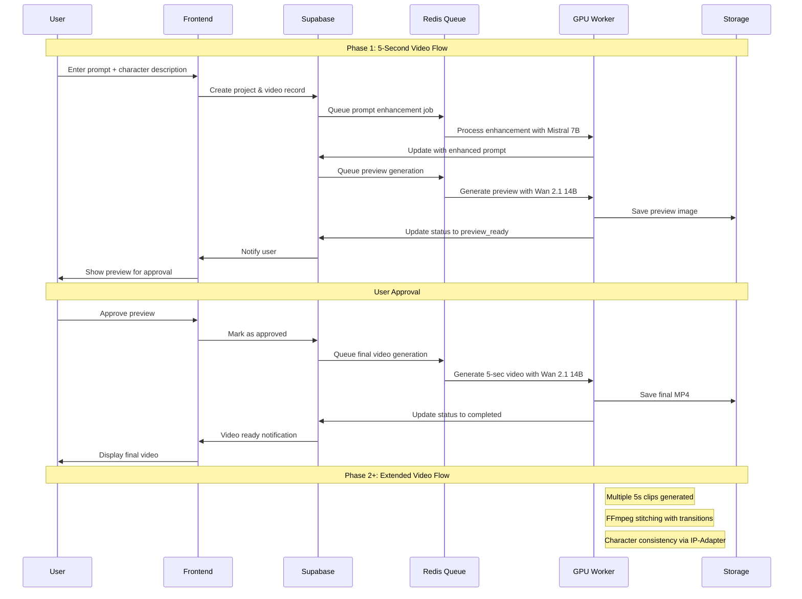

# **Product Requirements Document (PRD) v2.0**
**OurVidz.com - AI Video Generation Platform**
**updated June 21, 2025**

## **Executive Summary**

OurVidz.com is a web-based platform enabling users to generate personalized adult content using AI, with a phased approach to feature development. Phase 1 delivers core 5-second video generation with text-based character descriptions, scaling to 30-minute videos through intelligent clip stitching in future phases.

---

## **1. Product Overview**

### **1.1 Vision Statement**

Create an accessible, user-friendly platform that democratizes adult content creation through AI video generation, ensuring character consistency and creative control while scaling from simple to sophisticated workflows.

### **1.2 Core Value Propositions**

- **Progressive Complexity**: Start simple (5s videos) → Scale to full productions (30min)
- **Character Persistence**: Maintain consistent characters across scenes and videos
- **Creative Control**: Preview-approve workflow before final generation
- **Cost Efficiency**: Pay-per-use model with transparent credit system
- **Privacy First**: No data retention, encrypted processing, NSFW-friendly
- **Quality Output**: Cinema-quality videos powered by Wan 2.1 14B

### **1.3 Target Users**

- **Primary**: Independent adult content creators seeking AI-powered production tools
- **Secondary**: Couples creating personalized content for private use
- **Future**: Small adult entertainment studios, artists, and animators

---

## **2. Product Strategy & Phased Development**

### **2.1 Phase 1: Core Video Generation (Weeks 1-4)**
**Target**: Minimum viable product with essential video creation workflow

**Features:**
- Single 5-second video generation
- Text-based character descriptions
- Preview-approve workflow
- Basic user interface
- Subscription management

**Success Criteria:**
- 100% video generation success rate
- <6 minutes total generation time
- 2-3 satisfied beta users
- Mobile-responsive experience

### **2.2 Phase 2: Character System (Month 2)**
**Target**: Enhanced character management and consistency

**Features:**
- Character image uploads
- IP-Adapter integration for visual consistency
- Character library management
- Multi-length videos (5s, 15s, 30s via stitching)

**Success Criteria:**
- 90%+ character consistency across videos
- 20+ active users
- Extended video lengths working

### **2.3 Phase 3: Advanced Production (Month 3)**
**Target**: Professional-grade video creation capabilities

**Features:**
- Storyboard generation workflow
- Multi-scene videos up to 5 minutes
- Advanced editing capabilities
- Scene transition optimization

**Success Criteria:**
- 100+ videos generated monthly
- $500+ Monthly Recurring Revenue
- User satisfaction >4.0/5.0

### **2.4 Phase 4: Scale & Enterprise (Month 4+)**
**Target**: Full PRD vision with enterprise capabilities

**Features:**
- Videos up to 30 minutes
- Audio generation integration
- Advanced analytics
- API access for developers
- Team/studio accounts

---

## **3. Technical Architecture**

### **3.1 System Architecture Overview**

```
┌─────────────────────────────────────────────────────────────┐
│ Frontend Layer                                              │
├─────────────────────────────────────────────────────────────┤
│ React + TypeScript │ Tailwind CSS │ Lovable/Netlify        │
│ Cost: FREE                                                  │
└────────────────────────┬────────────────────────────────────┘
                         │
┌────────────────────────▼────────────────────────────────────┐
│ Backend Services                                            │
├─────────────────────────────────────────────────────────────┤
│ Supabase Cloud │ Cost: $25/mo                              │
│ - PostgreSQL (metadata, jobs, users)                       │
│ - Auth (user management)                                    │
│ - Storage (videos/images)                                   │
│ - Edge Functions (API gateway)                              │
└────────────────────────┬────────────────────────────────────┘
                         │
┌────────────────────────▼────────────────────────────────────┐
│ Queue Management                                            │
├─────────────────────────────────────────────────────────────┤
│ Upstash Redis │ Cost: $10/mo                               │
│ Job orchestration and queue management                      │
└────────────────────────┬────────────────────────────────────┘
                         │
┌────────────────────────▼────────────────────────────────────┐
│ GPU Processing Layer                                        │
├─────────────────────────────────────────────────────────────┤
│ RunPod RTX 4090 │ Cost: $0.40/hr                           │
│ - Wan 2.1 14B (video generation)                           │
│ - Mistral 7B (prompt enhancement)                           │
│ - Future: IP-Adapter (character consistency)                │
└─────────────────────────────────────────────────────────────┘
```

### **3.2 Model Selection & Rationale**

#### **3.2.1 Video Generation: Wan 2.1 14B**

**Choice Justification:**
- ✅ **Apache 2.0 License**: No content restrictions, perfect for NSFW
- ✅ **State-of-the-art Performance**: Outperforms both open and closed-source models
- ✅ **RTX 4090 Compatible**: 14B model fits within 24GB VRAM
- ✅ **Production Ready**: Actively maintained by Alibaba's Tongyi Lab
- ✅ **Multilingual Support**: Generates text in videos (Chinese/English)

**Technical Specifications:**
```yaml
Model: Wan-AI/Wan2.1-T2V-14B
License: Apache 2.0
VRAM: 20-22GB peak usage
Performance: 4-6 minutes for 5-second 720p video
Resolution: 720p (1280x720), upgradeable to 1080p
Frame Rate: 16fps
Quality: VBench score 84.7%+ (industry-leading)
```

**Alternatives Considered:**
- ❌ **LTX-Video**: Faster but lower quality
- ❌ **HunyuanVideo**: Good quality but slower, larger VRAM requirements
- ❌ **Stable Video Diffusion**: Limited to 4-second videos, lower quality

#### **3.2.2 Prompt Enhancement: Mistral 7B Instruct**

**Choice Justification:**
- ✅ **No Content Restrictions**: Handles NSFW prompts without filtering
- ✅ **Optimal Size**: Fits alongside Wan 2.1 in 24GB VRAM budget
- ✅ **Self-hosted**: No API costs or external dependencies
- ✅ **High Quality**: Excellent prompt understanding and enhancement

#### **3.2.3 Phase 2: Character Consistency via IP-Adapter**

**Future Integration:**
- **IP-Adapter + Wan 2.1**: Best balance of quality and performance
- **Alternative**: LoRA training (higher quality but 15min setup per character)
- **Alternative**: InstantID (faster but less consistent results)

### **3.3 Data Flow Architecture**



---

## **4. Feature Requirements**

### **4.1 Phase 1: Core Features (MVP)**

#### **4.1.1 User Journey Flow**
1. **Age Verification** → 2. **Account Creation** → 3. **Character Setup (Text)** → 4. **Prompt Input** → 5. **Preview Generation** → 6. **Approval** → 7. **Video Generation** → 8. **Download**

#### **4.1.2 Essential Features**

**Character Management (Text-Based)**
- Simple text descriptions: "Blonde woman, athletic build, blue eyes"
- Character naming and tagging system
- Reusable character profiles
- Description enhancement suggestions

**Video Generation Workflow**
- Natural language prompt input
- Mistral 7B automatic prompt enhancement
- Wan 2.1 14B preview frame generation
- User approval step
- Final 5-second video generation

**User Interface**
- Mobile-first responsive design
- Real-time generation status
- Progress indicators and estimated completion times
- Simple, intuitive video player

**Subscription Management**
- Credit-based system (1 credit = 1 video)
- Subscription tiers: Starter (10), Pro (25), Creator (60)
- Usage tracking and billing integration

#### **4.1.3 Video Output Specifications**
```yaml
Duration: 5 seconds (Phase 1)
Resolution: 720p (1280x720)
Frame Rate: 16fps
Format: MP4 with H.264 encoding
File Size: 15-25MB typical
Quality: High-definition, web-optimized
```

### **4.2 Phase 2: Character Images & Extended Videos**

#### **4.2.1 Character Image System**
- Upload reference photos (multiple angles)
- IP-Adapter embedding generation
- Character consistency across videos
- Visual character library

#### **4.2.2 Extended Video Lengths**
```yaml
Video Length Options:
  5s: 1 clip, 1 credit
  15s: 3 clips stitched, 2 credits  
  30s: 6 clips stitched, 3 credits
  60s: 12 clips stitched, 5 credits
```

#### **4.2.3 Video Stitching Technology**
- Intelligent scene transitions
- Character consistency between clips
- Smooth motion interpolation
- Audio sync preparation

### **4.3 Phase 3: Advanced Production Features**

#### **4.3.1 Storyboard System**
- Story input in natural language
- Automatic scene breakdown
- Visual storyboard generation
- Scene-by-scene approval workflow

#### **4.3.2 Multi-Scene Video Production**
- Up to 5-minute videos (60 × 5-second clips)
- Scene-to-scene character consistency
- Advanced editing capabilities
- Professional-quality output

### **4.4 Non-Functional Requirements**

- **Performance**: <6 minutes total generation time (Phase 1)
- **Availability**: 99% uptime during business hours
- **Security**: End-to-end encryption, no content logging
- **Compliance**: Age verification, content warnings, GDPR/CCPA
- **Scalability**: Support 100+ concurrent users by Phase 3

---

## **5. Cost Analysis & Business Model**

### **5.1 Infrastructure Costs (Updated)**

#### **5.1.1 Monthly Operating Costs (100 videos/month)**

| Service | Usage | Cost | Calculation |
|---------|-------|------|-------------|
| **RunPod RTX 4090** | 100 videos × 5 min | **$3.32** | Wan 2.1 14B processing |
| **Supabase Pro** | Database + Storage | **$25.00** | User data + video files |
| **Upstash Redis** | Job queue | **$10.00** | Queue operations |
| **Netlify** | Frontend hosting | **$0.00** | Free tier sufficient |
| **Domain & SSL** | ourvidz.com | **$1.25** | Annual cost |
| **Total** | | **$39.57** | **$0.40 per video** |

#### **5.1.2 Scaling Costs (1,000 videos/month)**

| Service | Cost | Notes |
|---------|------|-------|
| **RunPod RTX 4090** | $33.20 | Linear scaling |
| **Supabase Pro** | $25.00 | Sufficient for 1K videos |
| **Upstash Redis** | $50.00 | Higher queue volume |
| **CDN (Cloudflare)** | $20.00 | Video delivery optimization |
| **Total** | **$128.20** | **$0.13 per video** |

### **5.2 Revenue Model**

#### **5.2.1 Subscription Tiers**
```yaml
Starter Plan: $9.99/month
  - 10 videos (5-second each)
  - Text-based characters
  - Basic support
  - Revenue per video: $1.00

Pro Plan: $19.99/month  
  - 25 videos (5-second each)
  - All Starter features
  - Priority generation queue
  - Revenue per video: $0.80

Creator Plan: $39.99/month
  - 60 videos (5-second each)  
  - All Pro features
  - Extended video lengths (Phase 2)
  - Revenue per video: $0.67
```

#### **5.2.2 Phase 2+ Extended Video Pricing**
```yaml
Credit System:
  5-second video: 1 credit
  15-second video: 2 credits (3 clips stitched)
  30-second video: 3 credits (6 clips stitched)
  60-second video: 5 credits (12 clips stitched)
  
Gross Margins:
  Phase 1: 60-87% (depending on tier)
  Phase 2+: 70-95% (economies of scale)
```

### **5.3 Financial Projections**

#### **5.3.1 Break-even Analysis**
- **Fixed Costs**: $40/month (infrastructure)
- **Variable Cost**: $0.40 per video
- **Break-even**: 40 Starter subscribers OR 20 Pro subscribers

#### **5.3.2 Success Milestones**
```yaml
Month 1 (Phase 1): 50 beta users
  - Revenue: $500 (testing phase)
  - Costs: $60
  - Net: $440

Month 3 (Phase 2): 200 active users  
  - Revenue: $3,000
  - Costs: $200
  - Net: $2,800
  
Month 6 (Phase 3): 1,000 active users
  - Revenue: $15,000
  - Costs: $800
  - Net: $14,200

Year 1 Target: $50,000+ ARR
```

---

## **6. Security & Compliance**

### **6.1 Content & Legal Compliance**

#### **6.1.1 Age Verification**
- **Phase 1**: Simple checkbox + localStorage verification
- **Phase 2**: Enhanced verification with ID checks
- **Jurisdiction**: US-only launch for regulatory simplicity

#### **6.1.2 Content Policy**
```yaml
Permitted Content:
  - AI-generated adult content
  - Fictional characters
  - User-created character descriptions
  - Artistic expression within legal bounds

Prohibited Content:
  - Real person likenesses without consent
  - Illegal content (per US federal law)
  - Minors or content appearing to depict minors
  - Non-consensual content
```

#### **6.1.3 Data Privacy**
- **Retention Policy**: 30-day automatic video deletion
- **Encryption**: TLS 1.3 in transit, AES-256 at rest
- **No Logging**: Prompts and content not stored long-term
- **GDPR/CCPA**: Data export and deletion rights

### **6.2 Technical Security**

#### **6.2.1 Infrastructure Security**
- **Authentication**: Supabase Auth with optional 2FA
- **Database**: Row Level Security (RLS) for multi-tenant isolation
- **Storage**: Private buckets with signed URL access
- **API**: Rate limiting and authentication on all endpoints

#### **6.2.2 Content Moderation Strategy**
```yaml
Phase 1: Manual Review (Beta Users Only)
  - Small user base allows manual oversight
  - Quick response to issues
  - Learn patterns for automated systems

Phase 2: Automated Filtering
  - NSFW detection on uploads
  - Prohibited content detection
  - User reporting system

Phase 3: Advanced Moderation
  - AI-powered content analysis
  - Community moderation tools
  - Appeals process
```

---

## **7. Implementation Roadmap**

### **7.1 Development Timeline**

#### **7.1.1 Phase 1: MVP (4 weeks) 🔄 In Progress**

**Week 1: Infrastructure ✅ COMPLETED**
- [x] Supabase project setup and configuration
- [x] Database schema with proper RLS policies
- [x] Storage buckets for videos and images
- [x] Edge Functions for job management
- [x] Frontend authentication integration

**Week 2: GPU Worker (Current)**
- [ ] RunPod account setup and Docker configuration
- [ ] Wan 2.1 14B model integration and testing
- [ ] Upstash Redis queue system
- [ ] End-to-end job processing pipeline

**Week 3: Frontend Development**
- [ ] Video creation interface
- [ ] Preview approval workflow
- [ ] Character management (text-based)
- [ ] Real-time status updates and polling

**Week 4: Launch Preparation**
- [ ] Comprehensive testing (end-to-end)
- [ ] Age verification implementation
- [ ] Mobile responsiveness optimization
- [ ] Beta user onboarding and documentation

#### **7.1.2 Phase 2: Character System (Month 2)**
- [ ] Character image upload system
- [ ] IP-Adapter integration with Wan 2.1
- [ ] Video stitching for 15s and 30s videos
- [ ] Enhanced character consistency testing

#### **7.1.3 Phase 3: Advanced Features (Month 3)**
- [ ] Storyboard generation workflow
- [ ] Multi-scene video production (up to 5 minutes)
- [ ] Advanced editing capabilities
- [ ] Professional-quality output optimization

### **7.2 Success Metrics & KPIs**

#### **7.2.1 Technical Metrics**
```yaml
Phase 1 Targets:
  - Video generation success rate: >95%
  - Average generation time: <6 minutes
  - System uptime: >99%
  - User error rate: <5%

Phase 2 Targets:
  - Character consistency: >90%
  - Extended video success: >90%
  - Performance improvement: 20% faster

Phase 3 Targets:  
  - Multi-scene quality: >95%
  - User satisfaction: >4.0/5.0
  - Feature adoption: >50% of users
```

#### **7.2.2 Business Metrics**
```yaml
Phase 1 Targets:
  - Beta users: 10-20 active
  - Videos generated: 100+ 
  - User retention: >70% week-over-week
  - Revenue: $500+ (testing phase)

Phase 2 Targets:
  - Active users: 200+
  - Monthly videos: 1,000+
  - Conversion rate: >15%
  - MRR: $3,000+

Phase 3 Targets:
  - Active users: 1,000+
  - Monthly videos: 10,000+
  - Customer LTV: >$100
  - ARR: $50,000+
```

---

## **8. Risk Assessment & Mitigation**

### **8.1 Technical Risks**

| Risk | Impact | Probability | Mitigation |
|------|--------|-------------|------------|
| **Wan 2.1 14B Performance Issues** | High | Medium | Fallback to 1.3B model, optimization techniques |
| **GPU Availability (RunPod)** | High | Low | Multi-region deployment, reserved instances |
| **Generation Quality Inconsistency** | Medium | Medium | Prompt optimization, model fine-tuning |
| **Storage Costs Escalation** | Medium | Low | Automated cleanup, compression optimization |

### **8.2 Business Risks**

| Risk | Impact | Probability | Mitigation |
|------|--------|-------------|------------|
| **Payment Processor Restrictions** | High | Medium | Adult-friendly providers (CCBill, Epoch) |
| **Legal/Regulatory Changes** | High | Low | Legal counsel, compliance monitoring |
| **Competition from Major Players** | Medium | High | Focus on UX quality, niche features |
| **Content Moderation Challenges** | Medium | Medium | Proactive policies, community guidelines |

### **8.3 Operational Risks**

| Risk | Impact | Probability | Mitigation |
|------|--------|-------------|------------|
| **Key Personnel Dependency** | Medium | Low | Documentation, code reviews, knowledge sharing |
| **Scaling Infrastructure Costs** | Medium | Medium | Usage-based pricing, cost monitoring |
| **User Support Overwhelm** | Low | Medium | Automated support, FAQ system |

---

## **9. Competitive Analysis**

### **9.1 Current Market Landscape**

#### **9.1.1 Direct Competitors**
```yaml
SoulGen (Image-focused):
  Strengths: Established user base, anime style
  Weaknesses: No video generation, limited realism
  
Civitai (Community-driven):
  Strengths: Large model library, active community
  Weaknesses: Complex UX, no integrated workflow
  
Various OnlyFans AI Tools:
  Strengths: Market presence
  Weaknesses: Quality issues, limited customization
```

#### **9.1.2 Competitive Advantages**
- ✅ **Wan 2.1 14B**: State-of-the-art video generation quality
- ✅ **End-to-End Workflow**: Complete production pipeline
- ✅ **Character Consistency**: Advanced IP-Adapter integration
- ✅ **No Content Restrictions**: Apache 2.0 licensing
- ✅ **Progressive Scaling**: 5-second to 30-minute videos
- ✅ **Mobile-First**: Optimized for modern usage patterns

### **9.2 Differentiation Strategy**

#### **9.2.1 Technical Differentiation**
- **Quality Leadership**: Best-in-class video generation with Wan 2.1 14B
- **Workflow Innovation**: Preview-approve system reduces wasted credits
- **Character Technology**: Superior consistency across videos and scenes

#### **9.2.2 User Experience Differentiation**
- **Simplicity**: Start with 5-second videos, scale complexity gradually
- **Mobile Optimization**: Unlike desktop-focused competitors
- **Transparent Pricing**: Clear credit system, no hidden costs

---

## **10. Final Recommendations & Launch Strategy**

### **10.1 Go-to-Market Strategy**

#### **10.1.1 Phase 1 Launch (Soft Launch)**
```yaml
Target Audience: 10-20 beta users
Channels: 
  - Direct outreach to adult content creators
  - Reddit communities (r/aiart, NSFW communities)
  - Twitter/X AI art communities
  
Goals:
  - Validate core workflow
  - Gather user feedback
  - Identify technical issues
  - Refine pricing model
```

#### **10.1.2 Phase 2 Launch (Public Beta)**
```yaml
Target Audience: 100-200 early adopters
Channels:
  - Product Hunt launch
  - Adult industry publications
  - Influencer partnerships
  - SEO-optimized content marketing
  
Goals:
  - Scale user base
  - Generate revenue ($3K+ MRR)
  - Build brand awareness
  - Gather feature requests
```

#### **10.1.3 Phase 3 Launch (Full Public Release)**
```yaml
Target Audience: 1,000+ mainstream users
Channels:
  - Paid advertising (where permitted)
  - Content marketing and SEO
  - Partnership with adult platforms
  - Referral program
  
Goals:
  - Achieve product-market fit
  - Scale to $50K+ ARR
  - Expand feature set
  - Prepare for Series A funding
```

### **10.2 Critical Success Factors**

#### **10.2.1 Technical Excellence**
- Maintain >95% video generation success rate
- Keep generation times under 6 minutes
- Ensure mobile-responsive experience
- Deliver consistent character representation

#### **10.2.2 User Experience**
- Intuitive workflow for non-technical users
- Clear pricing and credit system
- Responsive customer support
- Continuous UX improvements based on feedback

#### **10.2.3 Business Execution**
- Achieve break-even by Month 2
- Maintain gross margins >60%
- Build sustainable user acquisition channels
- Establish strategic partnerships

---

## **Conclusion**

This updated PRD reflects a pragmatic, phased approach to building OurVidz.com. By starting with core 5-second video generation using Wan 2.1 14B and scaling systematically to 30-minute productions, we can validate the market, generate revenue, and build toward the full vision.

**Key Success Enablers:**
1. **Wan 2.1 14B**: State-of-the-art, unrestricted video generation
2. **Phased Development**: Start simple, scale complexity
3. **Character Consistency**: Progressive enhancement from text to images
4. **Mobile-First**: Modern UX that competitors lack
5. **Clear Business Model**: Transparent pricing with healthy margins

**Immediate Priority**: Complete Phase 1 MVP with Wan 2.1 14B integration and launch with 10-20 beta users to validate core assumptions and gather feedback for Phase 2 development.
